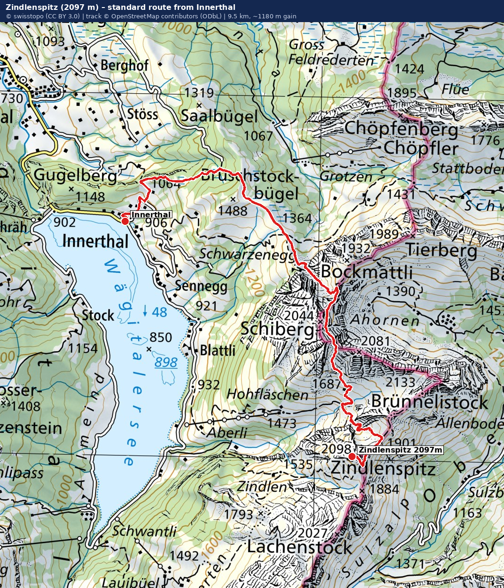

# Zindlenspitz (2097 m) — Hike README

> Also written **Zindelspitz** / **Zindelnspitz**. The SAC Route Portal uses
> **Zindlenspitz**. Elevation is **2097 m** (the "2260" in the SAC URL is an
> internal ID, not the height).

*Zindlenspitz, north face seen from the east on the ascent to Rossalpelispitz.
Photo: Wikimedia Commons.*

A characteristic limestone tooth above the Wägitalersee in the Schwyzer /
Glarner Alps. Quote from the SAC Route Portal:

> "Zindlenspitz is one of the most characteristic mountains of Wägital. Viewed
> from the valley, it looks so uninviting that you hesitate to choose it as
> your hiking target. However, the steep limestone tooth is astonishingly easy
> to climb: T3, which does not even qualify the summit as an alpine hiking
> summit." — *SAC Route Portal*

---

## Quick Facts

| Field | Value |
|---|---|
| Summit elevation | **2097 m** |
| Range | Schwyzer Alps (sub-range of the Glarner Alps) |
| Cantons | Schwyz (Innerthal) / Glarus (Glarus Nord) — border runs just east of summit |
| Valleys | **Wägital** (NW, Wägitalersee 900 m) and **Oberseetal** (SE) |
| Prominence | 196 m (col: unnamed saddle NE of summit) |
| Dominance | 1.2 km → Brünnelistock |
| Coordinates | 47°04′35″ N, 8°57′36″ E (CH1903: 715529 / 215037) |
| Activity type | Mountain hiking (Bergwandern) |
| Standard SAC grade | **T3** (steep but non-alpine) |
| Nearest big lake | Wägitalersee |
| Nearest village | Innerthal (Wägital, SZ) |

---

## Photos

| | |
|---|---|
|  |  |
| Zindlenspitz seen from Rosalpelispitz on a clear summer day. | The peak from the south-east; classic limestone tooth profile. |
|  |  |
| Rossalpelispitz (2075 m) **left** and Zindlenspitz (2097 m) **right** — the two summits of the standard ridge traverse. | Wägitalersee with the **trilogy** ridge: Brünnelistock, Rossalpelispitz, Zindlenspitz. |

All photos: Wikimedia Commons (CC BY-SA / public domain — see file pages).

---

## Route Map

*Map: SwissTopo Pixelkarte (© swisstopo, CC BY 3.0). Red line: actual GPS
track ([zindlenspitz.gpx](./zindlenspitz.gpx), 9.5 km, ~1180 m gain) routed
on the OpenStreetMap walkable network (© OpenStreetMap contributors, ODbL)
from Innerthal village to the summit node, snapping to within 5 m of the
village and 1 m of the summit. The pink line/dots already on the map are
the official SAC-marked hiking trails (swisstopo Wanderwege layer) — note
how the GPX track follows them almost exactly.*

### Live interactive maps (click to open)

- **[zindlenspitz.html](./zindlenspitz.html)** — local interactive Leaflet
  map in this folder. Loads the real [zindlenspitz.gpx](./zindlenspitz.gpx)
  track, with switchable SwissTopo / Wanderwege / aerial / OSM base layers.
  Open via a local web server (`python -m http.server` in this folder, then
  visit <http://localhost:8000/zindlenspitz.html>) so the browser can fetch
  the sibling GPX file.
- **[SAC Route Portal — Zindlenspitz](https://www.sac-cas.ch/en/huts-and-tours/sac-route-portal/zindlenspitz-2260/mountain-hiking/)**
  (route lines, photos, downloads).
- **[SwissTopo / map.geo.admin.ch — centered on the summit](https://map.geo.admin.ch/?lang=en&topic=ech&zoom=9&E=2715529&N=1215037&crosshair=marker&layers=ch.swisstopo.swisstlm3d-wanderwege)**
  — official Swiss topo with hiking trails layer enabled.
- **[SwissTopo aerial photo + hiking trails](https://map.geo.admin.ch/?lang=en&topic=ech&bgLayer=ch.swisstopo.swissimage&zoom=9&E=2715529&N=1215037&crosshair=marker&layers=ch.swisstopo.swisstlm3d-wanderwege)**
  — same view on satellite imagery.

### GPX

A real GPX track for this hike is included in this folder:
[`zindlenspitz.gpx`](./zindlenspitz.gpx) (9.52 km, 1078 trackpoints,
hardest tagged segment `alpine_hiking` near the summit ridge). It was
generated by routing on the OpenStreetMap walkable network between the
Innerthal village node and the Zindlenspitz peak node — both ground-truth
OSM nodes — preferring `highway=path` with `sac_scale` over roads. Drop it
into Komoot, OsmAnd, the SwissTopo app, Garmin, etc.

Other sources:

- **Komoot** — search "Zindlenspitz from Innerthal"; user-uploaded tracks
  with GPX export.
- **hikr.org** — many GPS-tagged trip reports under
  https://www.hikr.org/dir/Zindlenspitz_6039/ (German).
- **SwissTopo app** (iOS / Android) — draw a route along the official
  hiking trail and export GPX; works offline once the area tiles are
  downloaded.

---

## Routes (from the SAC Route Portal)

The SAC portal lists Zindlenspitz under `mountain-hiking`. There is one
currently active mountain-hiking entry plus archived guidebook routes.

### 1. **From the south (Wägitalersee / Innerthal)** — *standard route*
- Grade: **T3** (with a T5 variant on harder terrain near the summit ridge)
- Source: SAC archive document "Von Süden" / *Alpinführer Glarner Alpen (1)*,
  11. Edition 2013 (German).
- Start: **Innerthal / Wägitalersee** (~900 m). Reachable by Postbus from
  Siebnen-Wangen (S-Bahn from Zürich HB).
- Approach goes up through Hohfläschen alps (pastures and stables visible in
  the SAC photo) toward the south-west flank of the peak.
- Ascent gain: ~**1200 m** to the summit.
- This is the version normally meant when people say "hike up Zindlenspitz."

### 2. **Brünnelistock + Rossälplispitz + Zindlenspitz** — *traverse*
- Grade: **T5−** (demanding alpine hiking)
- Local nickname: "Wägitaler Trilogie" / "Hohfläschentrilogie" (per hikr.org).
- Three summits in one outing along the ridge; significant exposure and
  route-finding.
- **Not for beginners.** Requires sure-footedness, scrambling, and good
  weather.
- SAC URL slug:
  `bruennelistock-rossaelplispitz-and-zindlenspitz-4567`

### Archived guidebook reference
- *Alpinführer Glarner Alpen (1)*, 11th ed. 2013, German — listed in the
  SAC route archive entry for this peak.

---

## Difficulty

**Standard route:** SAC **T3** — demanding mountain hiking with some exposure
and a real need for sure-footedness.

**Trilogy traverse variant:** SAC **T5−** — alpine terrain with exposure,
scrambling, and route-finding.

See the [SAC difficulty scale guide](../guide/difficulty.html) for the full
T1-T6 grading system.

---

## Getting There

### By car
- Drive to **Innerthal** (Kanton Schwyz). Parking near the Wägitalersee dam
  or in Innerthal village.

### By public transport
- Train: Zürich HB → **Siebnen-Wangen** (≈40–50 min, S-Bahn).
- Bus: Postbus from Siebnen-Wangen / Schübelbach into the Wägital
  (terminus near Innerthal / Wägitalersee). Check `sbb.ch` for the day.

---

## Suggested Day Plan (standard T3 route)

Times are SAC-style estimates for a fit hiker.

| Time | Step |
|---|---|
| ~06:30 | Train Zürich HB → Siebnen-Wangen |
| ~08:30 | Bus reaches Innerthal / Wägitalersee, start hiking (~900 m) |
| ~09:00 | Hohfläschen alp |
| ~12:00–12:30 | Summit Zindlenspitz (2097 m) — total ascent ~3.5–4 h |
| ~12:30–13:00 | Lunch / photos at summit |
| ~15:30 | Back at Wägitalersee — descent ~2.5 h |
| ~17:00 | Bus + train back to Zürich |

Plan an **earlier start** if combining with Rossälplispitz / Brünnelistock or
if afternoon thunderstorms are forecast.

---

## Weather Planning

### Lapse-rate temperature estimate
Mountain temperature drops about **6.5 °C per 1000 m** of elevation.

- **Valley reference**: Schübelbach / Siebnen, ~400 m.
- **Summit**: 2097 m → ~1700 m above the reference → subtract ~**11 °C**.
- Example: valley forecast 10–21 °C → summit ≈ **−1 °C to +10 °C**.
- Pack for the cold end: hat, gloves, windproof, insulating layer.

### Sources to check the day before and the morning of
- **MeteoSwiss** (most accurate Swiss forecast):
  use the **Schübelbach** or **Innerthal** point forecast.
- **Meteoblue**: localized forecast + **nearby webcams**
  (e.g. Wägital / Innerthal / Amden) to confirm cloud, fog, snow line.
- **Thunderstorms** in the forecast → consider postponing. Wägital is a
  steep, narrow valley with limestone walls; lightning + wet rock = bad.

### Snow / season
- **Summer hike only.** The limestone is exposed and the upper section is
  steep; lingering snow patches dramatically raise the difficulty.
- Best window: roughly **late June to mid-October**, depending on snow.

---

## Gear Checklist

**Mandatory**
- Sturdy hiking boots (B-grade or better; ankle support).
- 2–3 L water + electrolytes.
- Food + emergency snack.
- Sun: hat, sunglasses, SPF 30+ (limestone reflects).
- Layers: base + insulating + windproof/rainproof shell.
- Hat + gloves (summit can be near freezing).
- Headlamp (cheap insurance for late descent).
- Phone with **offline SwissTopo map** + downloaded **GPX**.
- Small first-aid kit.
- Cash / card for the Postbus.

**Strongly recommended**
- Trekking poles (helps a lot on the descent).
- Power bank.
- Whistle.
- Printed bus / train timetable for the return.

**For the T5− trilogy traverse only**
- Helmet (loose rock on ridges).
- Light via ferrata set or short rope if your group wants a belay option.
- Significantly more time and an early start.

---

## Safety & Hazards

- **Exposure**: T3 ratings on this peak still mean steep grass and rock
  sections; a slip in places can have serious consequences.
- **Limestone**: dries fast but is **slippery when wet**. Avoid in or just
  after rain.
- **Thunderstorms**: ridge is fully exposed. Descend if weather builds.
- **Cattle**: alps below the peak have working cattle; mother cows with
  calves can be defensive — give them space.
- **Phone reception**: patchy in the Wägital. Download maps offline.
- **Emergency**: Swiss alpine rescue **1414** (Rega), or **112**.
- This is a **summer route**. Winter ascent is a different undertaking
  (avalanche terrain in places); not covered here.

---

## Resources & Links

- SAC Route Portal — Zindlenspitz (mountain hiking):
  https://www.sac-cas.ch/en/huts-and-tours/sac-route-portal/zindlenspitz-2260/mountain-hiking/
- SAC Route Portal — Brünnelistock + Rossälplispitz + Zindlenspitz traverse (T5−):
  https://www.sac-cas.ch/en/huts-and-tours/sac-route-portal/zindlenspitz-2260/mountain-hiking/bruennelistock-rossaelplispitz-and-zindlenspitz-4567/
- SAC Route Portal — "Von Süden" archive document (T3 / T5):
  https://www.sac-cas.ch/en/huts-and-tours/sac-route-portal/document/6473/
- Bockmattlihütte (nearest SAC-affiliated hut, T1, 1501 m):
  https://www.sac-cas.ch/en/huts-and-tours/sac-route-portal/bockmattlihuette-2147000037/
- Trip reports & photos (German, very useful):
  https://www.hikr.org/dir/Zindlenspitz_6039/
- German Wikipedia — Zindlenspitz:
  https://de.wikipedia.org/wiki/Zindlenspitz
- MeteoSwiss: https://www.meteoswiss.admin.ch/
- Meteoblue (Innerthal): https://www.meteoblue.com/en/weather/week/innerthal_switzerland
- SBB timetable: https://www.sbb.ch/en
- Swiss alpine rescue (Rega): **1414**

---

## Disclaimer

Compiled from the SAC Route Portal, German Wikipedia, and hikr.org references.
Not professional mountain-safety advice. Conditions in the Alps change
rapidly. **Always re-check MeteoSwiss, the SAC situation warnings, and any
trail closures before setting out.** If in doubt about your ability for the
T3 standard route — and especially the T5− trilogy — go with someone
experienced or hire a guide.
