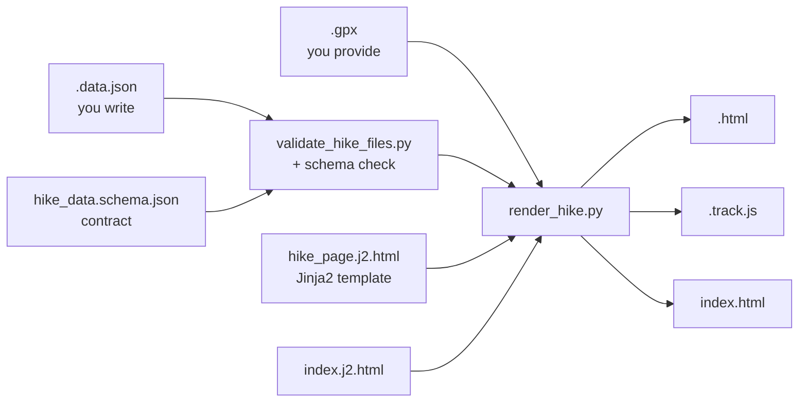

# Hike Page Workflow

All per-hike content lives in `routes/<slug>/<slug>.data.json`. The rendered HTML is
generated by `scripts/render_hike.py` from `templates/hike_page.j2.html`.

**Never hand-edit a generated `<slug>.html` or `<slug>.track.js` file.** Re-run `make render`.

---

## Render Pipeline



---

## Repo Structure

```
hikes/
  routes/                        # One folder per hike
    _assets/                     # Shared CSS + JS + favicons (synced from templates/_assets/ on render)
    augstmatthorn/               # Golden reference — start here
      augstmatthorn.data.json    # All content — edit this
      augstmatthorn.gpx          # GPX track — you provide this
      augstmatthorn.html         # Generated — do not hand-edit
      augstmatthorn.track.js     # Generated — do not hand-edit
    zindlenspitz/                # Example with SAC source data
      zindlenspitz.data.json     # Processed hike data — edit this
      zindlenspitz.gpx           # Extracted from SAC JSON
      zindlenspitz.html          # Generated
      zindlenspitz.track.js      # Generated
      sac-route-4567.json        # Raw SAC API capture (kept for reproducibility)
  scripts/
    # Pipeline (called by Makefile or imported by other scripts)
    render_hike.py               # data.json + GPX → HTML  (main workhorse)
    new_hike.py                  # scaffold a new empty hike directory
    validate_hike_files.py       # check every hike has all 4 required files
    extract_sac_route.py         # master SAC pipeline (JSON → GPX → scaffold → photos → metadata)
    extract_sac_gpx.py           # SAC route JSON → GPX track
    extract_sac_photos.py        # SAC route JSON → photo URLs in data.json
    config.py                    # shared constants imported by all scripts
    fetch_geodata.py             # canton/region GeoJSON from SwissTopo; imported by render_hike.py
    # Standalone utilities (run directly as needed)
    inspect_sac_json.py          # diagnostic: print SAC JSON structure for debugging captures
    check_gpx_gaps.py            # diagnostic: verify GPX track connectivity after extraction
    combine_gpx.py               # stitch two GPX tracks for multi-route traverses
    make_swiss_boundary.py       # one-shot: regenerate swiss_border.js from GADM boundary data
  templates/
    hike_page.j2.html            # Jinja2 hike page template
    index.j2.html                # Jinja2 index page template
    hike_data.schema.json        # JSON schema — the contract for data.json
    _assets/                     # Source CSS/JS/favicons (synced → routes/_assets/ on render)
  docs/
    schemas/
      DATA-SCHEMA.md             # Every field in data.json explained
    workflows/
      HIKING-WORKFLOW.md         # End-to-end walkthrough (this file)
      SAC-EXTRACTION.md          # SAC route portal extraction (GPX, photos, metadata)
      TROUBLESHOOTING.md         # Common errors and fixes
  .mcp.json                      # Playwright MCP server config
  AGENTS.md                      # Agent / AI assistant instructions
  index.html                     # Hike index (generated)
  Makefile
  requirements.txt
```

### Route folder contents

Each route folder (`routes/<slug>/`) contains:

| File | Source | Lifecycle |
|---|---|---|
| `<slug>.data.json` | You write / scripts populate | Permanent — the single source of truth |
| `<slug>.gpx` | Extracted from SAC JSON or your GPS | Permanent |
| `<slug>.html` | Generated by `render_hike.py` | Regenerated on `make render` |
| `<slug>.track.js` | Generated by `render_hike.py` | Regenerated on `make render` |
| `sac-route-<ID>.json` | Captured via Playwright from SAC API | Permanent — raw source data, kept for reproducibility |

> [!NOTE]
> All route-specific files live in the route folder — never in the repo root.

---

## Build Targets

| Target | Description |
|---|---|
| `make new` | Scaffold a new hike directory with pre-filled data.json (requires slug, name, region, canton, grade, elev, trailhead) |
| `make render` | Render all hike HTML pages from data.json + GPX |
| `make validate` | Validate hike file completeness + schema (no output written) |
| `make serve` | Render then serve locally at http://localhost:8000/ |

---

## Adding a New Hike — Step by Step

### 1. Scaffold

```bash
make new slug=lisengrat name="Lisengrat" region="Alpstein" canton="Appenzell" grade=T3 elev=2262 trailhead="Wasserauen"
```

Creates `routes/lisengrat/lisengrat.data.json` pre-filled with stub values (`"TODO"` markers).

### 2. Provide the GPX

Get a GPX track via the SAC browser extraction method (preferred) or from your GPS device.
Place it at:

```
routes/<slug>/<slug>.gpx
```

The render script reads the GPX to compute distance, elevation gain/loss, elevation range,
and the interactive map track. Without a GPX the render will fail.

### 3. Fill in `data.json`

Open `routes/<slug>/<slug>.data.json` and fill in every field.

**Use `routes/augstmatthorn/augstmatthorn.data.json` as the golden reference** — it is
fully populated and shows exactly what each field should look like.

See `docs/schemas/DATA-SCHEMA.md` for the full field reference.

Fill every section — see `docs/schemas/DATA-SCHEMA.md` for the full field reference and required/optional
status of each field. The key sections are:

- Identity: `slug`, `page`, `peak`, `index_card`
- Location: `trailhead`, `waypoints`
- Visuals: `hero`, `photos`
- Content: `intro_html`, `quick_facts`, `routes`, `getting_there`, `day_plans`
- Conditions: `weather`, `webcams`
- Reports & gear: `trip_reports`, `gear`
- Boilerplate: `safety_html`, `resources_html`, `disclaimer_html`

### 4. Photos

Photos are **URLs embedded in `data.json`** — this repo does not download or store images.

**SAC extraction (preferred method):**

```bash
# Extract photos from SAC route JSON, with peak hero image:
python scripts/extract_sac_photos.py --json routes/<slug>/sac-route-<ID>.json --slug <slug> \
    --peak-hero "<peak-page-hero-url>"
```

The script populates `photos[]` and `photos_attrib_html` in `data.json`, and sets `hero.image_url` from the peak hero.

**Photo sourcing priority:**
1. **SAC peak page** — hero image (best for summit/banner photo, captured via Playwright)
2. **SAC route JSON** — `photos[]` gallery (trail and landscape shots, public CDN URLs)
3. **Hikr.org** — direct image URLs (`https://f.hikr.org/files/...l.jpg`)
4. **Your own** — host externally (Google Drive public link, etc.)

Avoid Wikimedia Commons — bot detection makes URLs unreliable.

See [`docs/workflows/SAC-EXTRACTION.md`](SAC-EXTRACTION.md) for the full photo extraction workflow.

If you leave `hero.image_url` as `"TODO"`, the render script auto-populates it from
`photos[0].url`. This is the recommended approach — keep hero in sync with your photos array
without manual duplication.

### 5. Validate and Render

```bash
make validate   # check schema + file completeness
make render     # generate HTML
make serve      # preview at http://localhost:8000/
```

---

## Re-rendering After Changes

After any edit to `data.json`, templates, or CSS/JS:

```bash
make render
```

The render is fast (~50ms per hike). The index page (`index.html`) is always regenerated
alongside hike pages.

---

## File Inventory

Every hike directory must contain these 4 permanent files:

| File | Source |
|---|---|
| `<slug>.data.json` | You write / scripts populate |
| `<slug>.gpx` | You provide or extract from SAC |
| `<slug>.html` | Generated by `render_hike.py` |
| `<slug>.track.js` | Generated by `render_hike.py` |

Plus one temporary file during SAC extraction:

| File | Source |
|---|---|
| `sac-route-<ID>.json` | Captured via Playwright — delete after `data.json` is complete |

`make validate` checks for completeness and will report any missing files.
